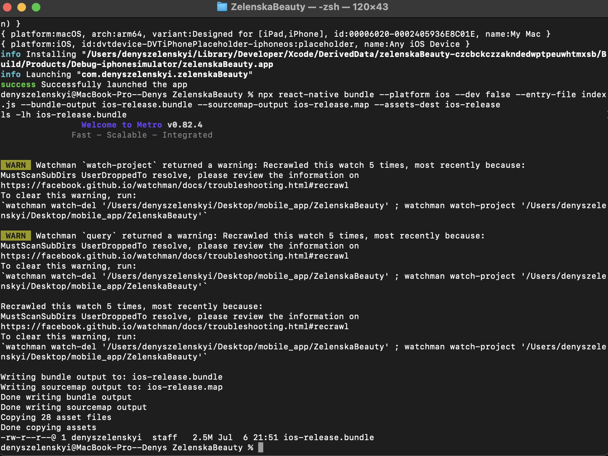
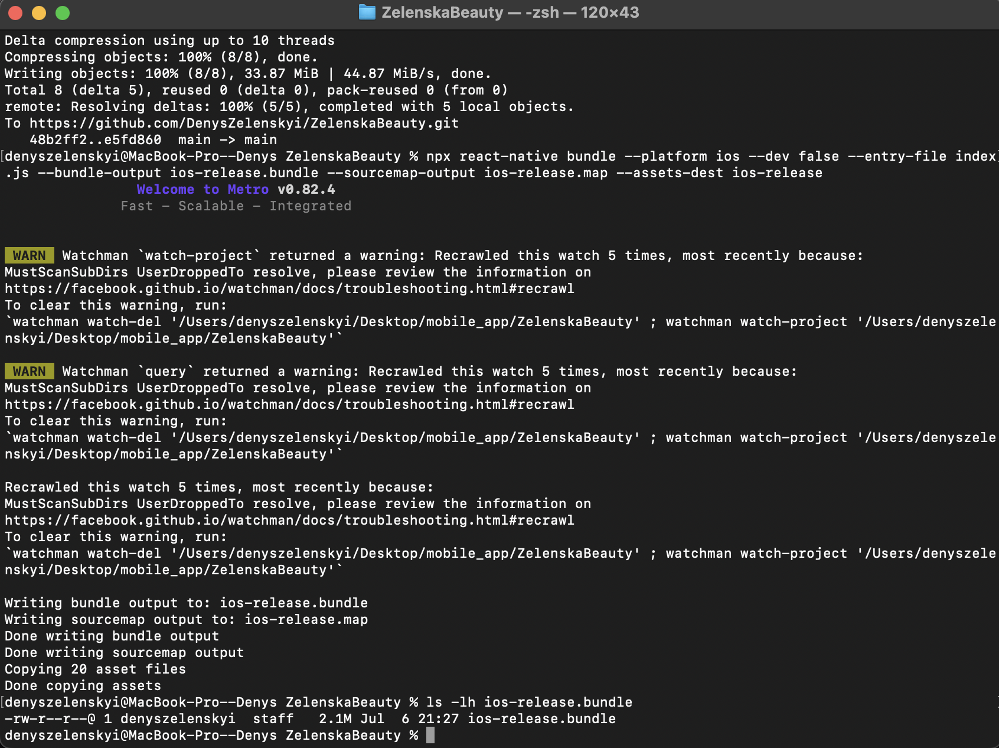

Порівняння до та після оптимізації

- **До оптимізації (з react-native-calendars):**
  

  - Розмір: **2.5 MB**

- **Після оптимізації (з CustomCalendar):**
  
  - Розмір: **2.1 MB**

Висновок

- Видалення важкої залежності `react-native-calendars` та заміна її на власний компонент дозволило зменшити розмір бандлу на 0.4 MB (~16%).
- Це позитивно вплине на швидкість завантаження застосунку та оновлень для користувачів.
