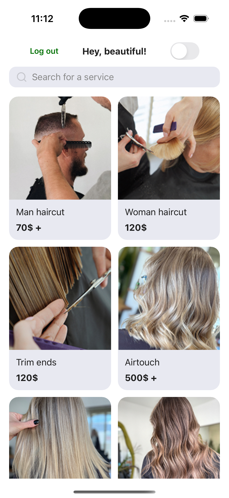
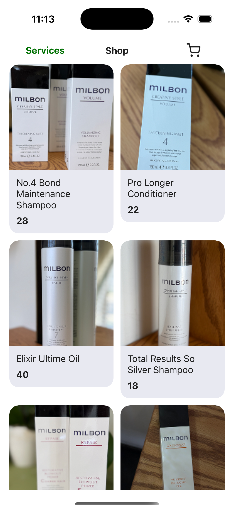
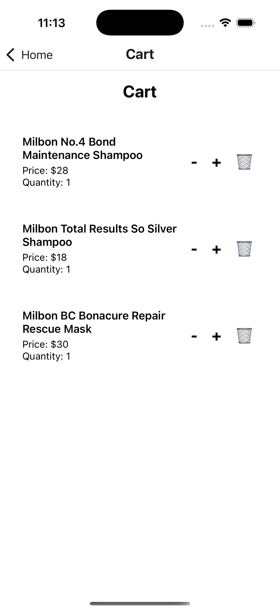
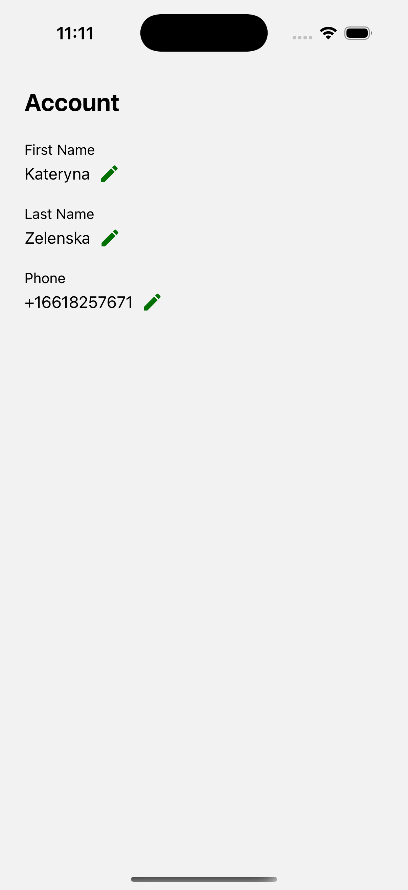
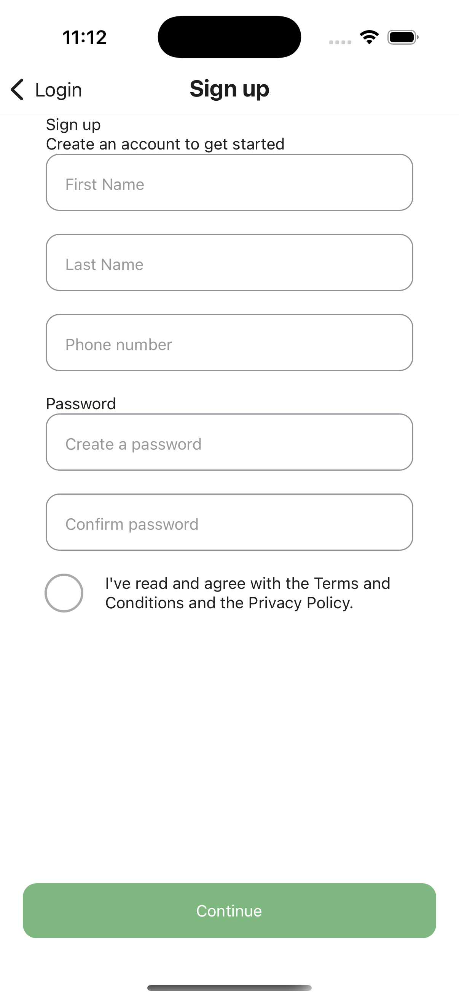
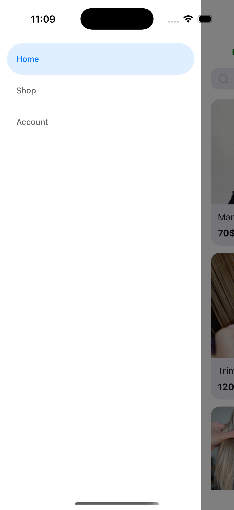

# ZelenskaBeauty — Mobile App

## Опис

**ZelenskaBeauty** — це мобільний застосунок для салону краси, який дозволяє користувачам:

- Переглядати та бронювати послуги
- Купувати товари у магазині
- Керувати своїм профілем
- Користуватися сучасним та зручним інтерфейсом

---

## Основні функції

- **Головна сторінка:** список послуг, пошук, деталі послуги
- **Магазин (Shop):** товари, додавання у кошик, перегляд кошика
- **Бронювання:** вибір дати, часу, підтвердження запису
- **Реєстрація та логін:** з валідацією, унікальністю телефону, збереженням у Redux
- **Профіль користувача:** перегляд та редагування firstName, lastName, телефону
- **Темна/світла тема:** перемикач теми, глобальна підтримка через Context API
- **Бокове меню (Drawer):** зручна навігація між основними секціями
- **Анімації:** плавні переходи між екранами, анімований “хвостик” для підказки про меню

---

## Ключові нововведення (за останній спринт)

- Додана функція реєстрації користувача
- Окремі поля firstName та lastName у реєстрації та профілі
- Додана сторінка "Account" для змінення імені, фаміліі чи номера телефона
- Перевірка унікальності телефону при реєстрації та редагуванні профілю
- Збереження користувача у Redux після логіну/реєстрації
- Збереження користувача в mockapi.io
- Анімований “хвостик” для підказки про бокове меню
- Плавні анімації переходів між екранами (slide, fade)

---

## Структура проєкту

- `src/components` — універсальні компоненти (InputField, MainButton, ServiceCard тощо)
- `src/screens` — екрани застосунку (HomeScreen, ShopScreen, ProfileScreen, CartScreen, ...)
- `src/redux` — глобальний стан (user, cart)
- `src/api` — робота з mockapi.io
- `src/styles` — палітра кольорів, глобальні стилі
- `screenshots` — скріншоти ключових екранів

---

## Скриншоти

| Головна                         | Магазин                   | Кошик                     | Профіль                      |
| ------------------------------- | ------------------------- | ------------------------- | ---------------------------- |
|  |  |  |  |

| Реєстрація                  | Drawer-меню                 | Анімація хвостика |
| --------------------------- | --------------------------- | ----------------- |
|  |  |

---

## Логіка прийнятих рішень

- **Redux для користувача та кошика:** централізоване зберігання, масштабованість, зручно для складних сценаріїв.
- **Context API для теми:** простий глобальний стан, не потребує складної логіки.
- **mockapi.io:** швидке тестування CRUD-операцій, простота інтеграції.
- **Анімований “хвостик”:** ненав’язлива підказка про бокове меню без втручання у навігацію.

---

## Запуск

1. Встановіть залежності:
   ```
   npm install
   ```
2. Запустіть Metro bundler:
   ```
   npm start
   ```
3. Запустіть на емуляторі або пристрої:
   ```
   npm run android
   ```
   або
   ```
   npm run ios
   ```

---

## Автор

Denys Zelenskyi
